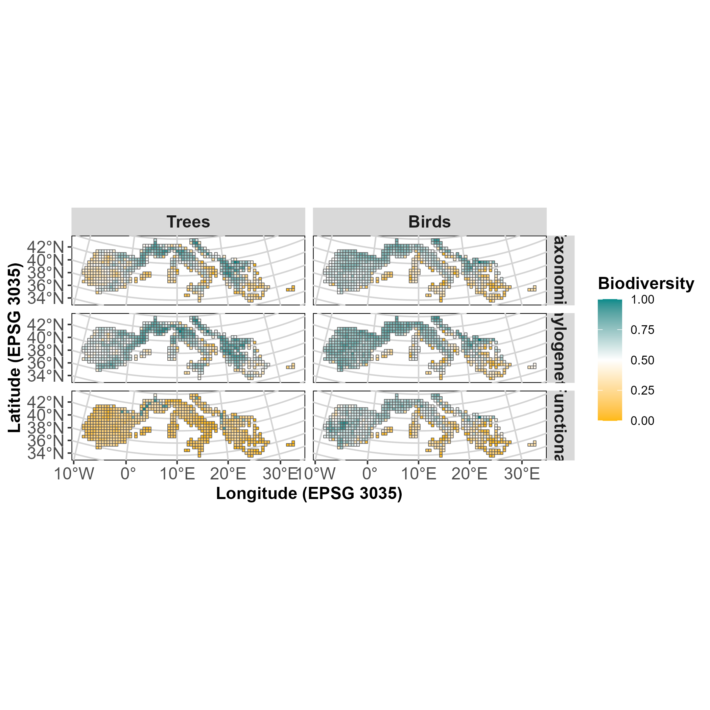

<!-- README.md is generated from README.Rmd. Please edit that file -->

# cesab_biodiversity 

<!-- badges: start -->

[](https://choosealicense.com/licenses/gpl-2.0/)
<!-- badges: end -->

<p align="left">
• <a href="#overview">Overview</a><br> •
<a href="#features">Features</a><br> •
<a href="#content">Content</a><br> •
<a href="#installation">Installation</a><br> •
<a href="#usage">Usage</a><br> • <a href="#citation">Citation</a><br> •
<a href="#contributing">Contributing</a><br> •
<a href="#acknowledgments">Acknowledgments</a><br> •
<a href="#references">References</a>
</p>

## Overview

This research compendium was created in order to map biodiversity facets
(taxonomic, functional and phylogenetic) for both breeding birds and
trees across the Euro-Mediterranean Basin. A sub-goal is to make the
workflow as reproducible as possible.

## Features

The main purpose of this compendium was to make an already written
workflow into a more comprehensive, coherent and reproducible project.

## Content

This repository is structured as follow:

- [`DESCRIPTION`](https://github.com/MCartereau/cesab_biodiversity/tree/main/DESCRIPTION):
  contains project metadata (authors, date, dependencies, etc.)

- [`make.R`](https://github.com/MCartereau/cesab_biodiversity/tree/main/make.R):
  main R script to run the entire project

- [`R/`](https://github.com/MCartereau/cesab_biodiversity/tree/main/R):
  contains R functions developed especially for this project

- [`data/`](https://github.com/MCartereau/cesab_biodiversity/tree/main/data):
  contains raw- and derived-data.

Here you can view the functions and data as an inter-connected network
using the **targets** R package :

`{mermaid} graph LR   style Legend fill:#FFFFFF00,stroke:#000000;   style Graph fill:#FFFFFF00,stroke:#000000;   subgraph Legend     direction LR     x7420bd9270f8d27d([""Up to date""]):::uptodate --- xbf4603d6c2c2ad6b([""Stem""]):::none     xbf4603d6c2c2ad6b([""Stem""]):::none --- xf0bce276fe2b9d3e>""Function""]:::none   end   subgraph Graph     direction LR     xbb143773a1cb2b23(["select_occ"]):::uptodate --> xb77fdba8fe3ce685(["format_sp_tree_phylo_site"]):::uptodate     x7b33e919ce5cbac1>"sp_site_mat_phylo"]:::uptodate --> xb77fdba8fe3ce685(["format_sp_tree_phylo_site"]):::uptodate     xbb143773a1cb2b23(["select_occ"]):::uptodate --> x3a50c4b31ed650b8(["format_sp_animal_func_site"]):::uptodate     xef7e3debe112c732>"sp_site_mat_func"]:::uptodate --> x3a50c4b31ed650b8(["format_sp_animal_func_site"]):::uptodate     x5dcdc08906a20a5f>"path_spat_grid"]:::uptodate --> xf8d96fc6b141462f(["pathspatgrid"]):::uptodate     xfbd05326285103da(["load_occ"]):::uptodate --> xbb143773a1cb2b23(["select_occ"]):::uptodate     xcb32d684985471b8>"occ_select"]:::uptodate --> xbb143773a1cb2b23(["select_occ"]):::uptodate     x7661238a38043782>"path_occ"]:::uptodate --> xa532f974b8539006(["pathphylo"]):::uptodate     x05c6a7962a94a2d8(["load_traits"]):::uptodate --> x27e5e988aa202d09(["select_tree_traits"]):::uptodate     xdb419aacf0680012>"traits_select"]:::uptodate --> x27e5e988aa202d09(["select_tree_traits"]):::uptodate     x6df0f016a461c623>"load_phylo"]:::uptodate --> x835f247752e07f06(["load_phylogeny"]):::uptodate     xa532f974b8539006(["pathphylo"]):::uptodate --> x835f247752e07f06(["load_phylogeny"]):::uptodate     xdc4be63e3bf1a2ee>"load_csv"]:::uptodate --> x05c6a7962a94a2d8(["load_traits"]):::uptodate     xb12b2829b3667540(["pathtraits"]):::uptodate --> x05c6a7962a94a2d8(["load_traits"]):::uptodate     x05c6a7962a94a2d8(["load_traits"]):::uptodate --> xb34ffc6bb734487f(["select_animal_traits"]):::uptodate     xdb419aacf0680012>"traits_select"]:::uptodate --> xb34ffc6bb734487f(["select_animal_traits"]):::uptodate     xdc4be63e3bf1a2ee>"load_csv"]:::uptodate --> xfbd05326285103da(["load_occ"]):::uptodate     x366ee266f52e31e4(["pathocc"]):::uptodate --> xfbd05326285103da(["load_occ"]):::uptodate     x9746313bdc7c85a4(["format_sp_tree_func_site"]):::uptodate --> xd48af25bd279de3b(["comp_func_tree_rich"]):::uptodate     x9c7ff1e7e61c8a08>"func_rich"]:::uptodate --> xd48af25bd279de3b(["comp_func_tree_rich"]):::uptodate     x27e5e988aa202d09(["select_tree_traits"]):::uptodate --> xd48af25bd279de3b(["comp_func_tree_rich"]):::uptodate     x3a50c4b31ed650b8(["format_sp_animal_func_site"]):::uptodate --> x2ab28b4fab5a8e99(["comp_func_animal_rich"]):::uptodate     x9c7ff1e7e61c8a08>"func_rich"]:::uptodate --> x2ab28b4fab5a8e99(["comp_func_animal_rich"]):::uptodate     xb34ffc6bb734487f(["select_animal_traits"]):::uptodate --> x2ab28b4fab5a8e99(["comp_func_animal_rich"]):::uptodate     xb8cd4011fd86e612>"load_spat_grid"]:::uptodate --> x9c6bb4d922c76b6c(["load_spat"]):::uptodate     xf8d96fc6b141462f(["pathspatgrid"]):::uptodate --> x9c6bb4d922c76b6c(["load_spat"]):::uptodate     xbb143773a1cb2b23(["select_occ"]):::uptodate --> x55d7a6f684a267a2(["format_sp_animal_phylo_site"]):::uptodate     x7b33e919ce5cbac1>"sp_site_mat_phylo"]:::uptodate --> x55d7a6f684a267a2(["format_sp_animal_phylo_site"]):::uptodate     xbb143773a1cb2b23(["select_occ"]):::uptodate --> x9746313bdc7c85a4(["format_sp_tree_func_site"]):::uptodate     xef7e3debe112c732>"sp_site_mat_func"]:::uptodate --> x9746313bdc7c85a4(["format_sp_tree_func_site"]):::uptodate     xd0644b34ec4cf8ef(["comb_ind_rich"]):::uptodate --> xaf95534ce5e3f59e(["plot"]):::uptodate     x9c6bb4d922c76b6c(["load_spat"]):::uptodate --> xaf95534ce5e3f59e(["plot"]):::uptodate     xda5832bf3edb1e35>"plot_map"]:::uptodate --> xaf95534ce5e3f59e(["plot"]):::uptodate     x0f967386d5701b89>"id_phylo"]:::uptodate --> xd7c7c752663c12a8(["id_phy"]):::uptodate     x835f247752e07f06(["load_phylogeny"]):::uptodate --> xd7c7c752663c12a8(["id_phy"]):::uptodate     xd0644b34ec4cf8ef(["comb_ind_rich"]):::uptodate --> x04e94ee208381956(["index"]):::uptodate     x2ab28b4fab5a8e99(["comp_func_animal_rich"]):::uptodate --> x04e94ee208381956(["index"]):::uptodate     x034a42cc613af076(["comp_phylo_animal_rich"]):::uptodate --> x04e94ee208381956(["index"]):::uptodate     xe296c6a724b63249(["comp_sp_rich"]):::uptodate --> x04e94ee208381956(["index"]):::uptodate     x3a50c4b31ed650b8(["format_sp_animal_func_site"]):::uptodate --> x04e94ee208381956(["index"]):::uptodate     xfbd05326285103da(["load_occ"]):::uptodate --> x04e94ee208381956(["index"]):::uptodate     x835f247752e07f06(["load_phylogeny"]):::uptodate --> x04e94ee208381956(["index"]):::uptodate     x9c6bb4d922c76b6c(["load_spat"]):::uptodate --> x04e94ee208381956(["index"]):::uptodate     x05c6a7962a94a2d8(["load_traits"]):::uptodate --> x04e94ee208381956(["index"]):::uptodate     xaf95534ce5e3f59e(["plot"]):::uptodate --> x04e94ee208381956(["index"]):::uptodate     xb34ffc6bb734487f(["select_animal_traits"]):::uptodate --> x04e94ee208381956(["index"]):::uptodate     xbb143773a1cb2b23(["select_occ"]):::uptodate --> x04e94ee208381956(["index"]):::uptodate     x7661238a38043782>"path_occ"]:::uptodate --> x366ee266f52e31e4(["pathocc"]):::uptodate     x7661238a38043782>"path_occ"]:::uptodate --> xb12b2829b3667540(["pathtraits"]):::uptodate     xb77fdba8fe3ce685(["format_sp_tree_phylo_site"]):::uptodate --> xaeba6499a5806039(["comp_phylo_tree_rich"]):::uptodate     xd7c7c752663c12a8(["id_phy"]):::uptodate --> xaeba6499a5806039(["comp_phylo_tree_rich"]):::uptodate     x08c9a6230bab1bd2>"phy_rich"]:::uptodate --> xaeba6499a5806039(["comp_phylo_tree_rich"]):::uptodate     x2ab28b4fab5a8e99(["comp_func_animal_rich"]):::uptodate --> xd0644b34ec4cf8ef(["comb_ind_rich"]):::uptodate     xd48af25bd279de3b(["comp_func_tree_rich"]):::uptodate --> xd0644b34ec4cf8ef(["comb_ind_rich"]):::uptodate     x034a42cc613af076(["comp_phylo_animal_rich"]):::uptodate --> xd0644b34ec4cf8ef(["comb_ind_rich"]):::uptodate     xaeba6499a5806039(["comp_phylo_tree_rich"]):::uptodate --> xd0644b34ec4cf8ef(["comb_ind_rich"]):::uptodate     xe296c6a724b63249(["comp_sp_rich"]):::uptodate --> xd0644b34ec4cf8ef(["comb_ind_rich"]):::uptodate     x10c542ebff5ee38f>"ind_rich"]:::uptodate --> xd0644b34ec4cf8ef(["comb_ind_rich"]):::uptodate     xbb143773a1cb2b23(["select_occ"]):::uptodate --> xe296c6a724b63249(["comp_sp_rich"]):::uptodate     xa738a5e9ad8a8770>"sp_rich"]:::uptodate --> xe296c6a724b63249(["comp_sp_rich"]):::uptodate     x55d7a6f684a267a2(["format_sp_animal_phylo_site"]):::uptodate --> x034a42cc613af076(["comp_phylo_animal_rich"]):::uptodate     xd7c7c752663c12a8(["id_phy"]):::uptodate --> x034a42cc613af076(["comp_phylo_animal_rich"]):::uptodate     x08c9a6230bab1bd2>"phy_rich"]:::uptodate --> x034a42cc613af076(["comp_phylo_animal_rich"]):::uptodate     x0bd31d0b55f8823d>"path_phylo"]:::uptodate --> x0bd31d0b55f8823d>"path_phylo"]:::uptodate     xfa1f6486c67767f1>"path_traits"]:::uptodate --> xfa1f6486c67767f1>"path_traits"]:::uptodate   end   classDef uptodate stroke:#000000,color:#ffffff,fill:#354823;   classDef none stroke:#000000,color:#000000,fill:#94a4ac;   linkStyle 0 stroke-width:0px;   linkStyle 1 stroke-width:0px;   linkStyle 65 stroke-width:0px;   linkStyle 66 stroke-width:0px;`

## Installation

To install this compendium:

- [Fork](https://docs.github.com/en/get-started/quickstart/contributing-to-projects)
  this repository using the GitHub interface.
- [Clone](https://docs.github.com/en/repositories/creating-and-managing-repositories/cloning-a-repository)
  your fork using `git clone fork-url` (replace `fork-url` by the URL of
  your fork). Alternatively, open [RStudio
  IDE](https://posit.co/products/open-source/rstudio/) and create a New
  Project from Version Control.

## Usage

Launch the
[`make.R`](https://github.com/MCartereau/cesab_biodiversity/tree/main/make.R)
file with:

``` r
source("make.R")
```

**Notes**

- All required packages listed in the `DESCRIPTION` file will be
  installed (if necessary)
- All required packages and R functions will be loaded
- Some analyses listed in the `make.R` might take time

## Citation

Nothing yet…

## Contributing

All types of contributions are encouraged and valued. But no ALIENS !
For more information, check out our [Contributor
Guidelines](https://github.com/MCartereau/cesab_biodiversity/blob/main/CONTRIBUTING.md).

Please note that this project is released with a [Contributor Code of
Conduct](https://contributor-covenant.org/version/2/1/CODE_OF_CONDUCT.html).
By contributing to this project, you agree to abide by its terms.

## Acknowledgments

Thanks to the CESAB !!

## References

> Marwick B, Boettiger C, Mullen L. 2018. Packaging data analytical work
> reproducibly using R (and friends) PeerJ Preprints 6:e3192v2
> <https://doi.org/10.7287/peerj.preprints.3192v2>

> Casajus N, Bonnici I, Dray S, Gimenez O, Guéry L, Guilhaumon F,
> Schiettekatte NMD & Siberchicot A (2023) Workshop FRB-CESAB & RT
> EcoStat: Reproducible Research in Computational Ecology. Zenodo.
> <http://doi.org/10.5281/zenodo.4262978>.
